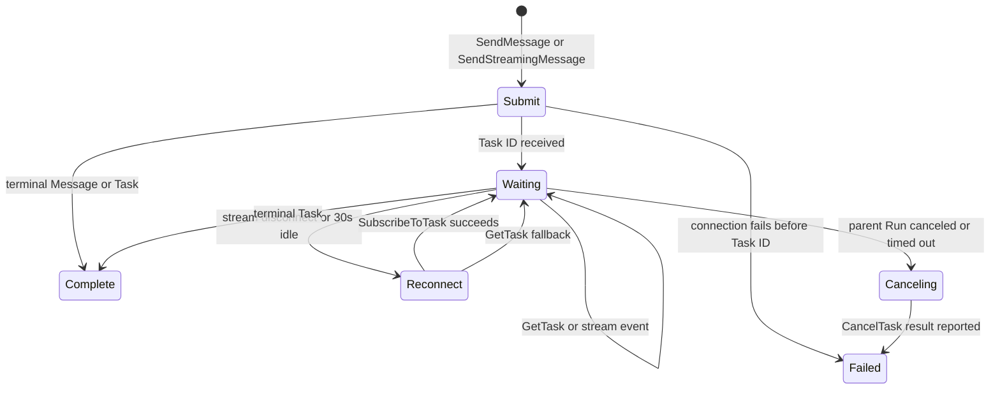

# A2A Task Lifecycle

The `a2wave-agent-router` treats A2A 1.0 work as a durable Task lifecycle, not as one long HTTP request.

## Invariants

1. There is no router-owned execution deadline. The calling Agent's Run timeout is authoritative.
2. The original message is sent exactly once. Recovery requires a Task ID and never replays the message.
3. Parent cancellation and Agent CLI process termination propagate to `CancelTask` when the downstream Task ID is known.
4. The Router catches process termination, aborts its active invocations, and waits for their cancellation cleanup before exiting.
5. A control request uses its own short deadline so an already-aborted parent signal cannot suppress cancellation or exceed the CLI process-group grace period.
6. A2A 0.3 remains wire-compatible, but task-aware reconnect and cancellation are guaranteed only for A2A 1.0.
7. A clean stream EOF is terminal only when the Task state is terminal. If an artifact or working status already exposed a Task ID, the router continues by ID instead of returning partial output as success.
8. Codex gives only the built-in `a2wave-agent-router` MCP tool the greater of its 660-second default or the calling Agent's execution budget plus a 10-second cleanup headroom. Other MCP servers retain the 660-second default tool timeout.

## State flow

Internal a2wave-to-a2wave calls and direct A2A 1.0 routes request an immediate Task response with `historyLength: 0` and poll `GetTask` with the same lightweight history setting. If any terminal entry point contains no displayable response accumulated from artifacts or final Agent messages, the router performs one bounded terminal read with the latest 20 history messages. Non-terminal status messages remain progress updates: they never suppress that final read and never become the successful final response when the terminal Task contains no output. Agent Card routes use streaming when the card advertises it. After a known Task's stream disconnects or stays idle for 30 seconds, the router attempts `SubscribeToTask` once and then falls back to `GetTask` polling. A transient terminal-history read failure after successful resubscription enters that same polling and exponential-backoff sequence without being mislabeled as a resubscription failure.

## Deadlines

| Operation | Deadline | Meaning |
|---|---:|---|
| Agent Card fetch | 15 seconds | End-to-end discovery / connection deadline, including DNS and redirect resolution |
| `GetTask` request | 15 seconds per attempt | End-to-end attempt deadline, including DNS and redirect resolution; transient network, 408/429, 5xx, and JSON-RPC internal errors are retried, while permanent protocol/client errors fail fast |
| `GetTask` retry delay | 1–30 seconds by default | Consecutive transient failures use capped exponential backoff with 0–25% jitter. A valid `Retry-After` seconds or HTTP-date value takes precedence even when it exceeds the local 30-second backoff cap; the parent Run can still abort the wait. A fully successful poll cycle, including any required terminal-history hydration, resets the retry sequence. |
| Known-Task stream idle | 30 seconds | Triggers reconnect; it does not fail the Task |
| `CancelTask` request | 3 seconds | Independent end-to-end best-effort control request, including DNS and redirect resolution, that finishes inside the CLI process-group shutdown grace period |
| Task execution | Calling Agent Run timeout | No fixed five-minute router deadline |

## Failure semantics

- If submission fails before a Task ID arrives, the router reports the failure and does not resend the message.
- If transport fails after a Task ID arrives, the router reconnects by ID.
- If reconnect and polling both fail permanently while the last observed Task is still non-terminal, the router attempts the independently timed `CancelTask` cleanup before reporting the original recovery failure. A Task already observed in a terminal state is not canceled again.
- One invocation-scoped result accumulator survives submission, resubscription, and polling. Incremental artifact append chunks and messages therefore remain continuous across a broken stream, while a full Task snapshot replaces the previous artifact snapshot. Artifact append accounting processes only each new chunk and does not repeatedly serialize or copy the accumulated artifact.
- If a known-Task stream closes cleanly before a terminal status, the router continues with `GetTask`; an artifact's final chunk does not imply that the Task itself is complete.
- If the parent ends after a Task ID arrives, the router sends `CancelTask` and returns an MCP error that includes the Task ID and cancellation outcome.
- If a known Task exceeds the invocation-wide event count or accumulated-result byte budget, the router preserves the limit error but first attempts the same independently timed `CancelTask` cleanup. Ordinary polling omits Task history, so a growing conversation is not retransferred and re-decoded once per poll; the one terminal history read remains subject to the same budgets.
- Agent CLI timeout and termination signals use the same path. The Router tracks active invocations, starts their cancellation cleanup on `SIGTERM`, `SIGINT`, `SIGHUP`, or stdin closure, waits for that cleanup, and only then closes its MCP transport and exits.
- `INPUT_REQUIRED` and `AUTH_REQUIRED` are actionable terminal states for one stateless router invocation. The response preserves the Task and context IDs; the router does not invent a follow-up message.

Lifecycle logs are emitted to stderr as structured JSON with event names such as `a2a.task.observed`, `a2a.task.reconnect`, `a2a.task.state`, and `a2a.task.cancel_result`. The Router allowlists and bounds the metadata before emission; the CLI process runner then validates the same safe projection before forwarding it into the parent Run's structured logs while the worker lease is still active. The Run UI renders these events in the ordinary execution timeline. Emitted and persisted metadata is limited to target, Task/context IDs, state, and retry attempt; messages, credentials, caller identity payloads, and arbitrary error fields are never written to the lifecycle line.

Polling forwards a progress message only when its text changes, so a peer that repeats the same working status does not generate one streaming-card update per second. Retry classification is similarly narrow: documented transient HTTP/JSON-RPC failures and recognizable network/timeouts retry with abortable exponential backoff, while malformed or otherwise deterministic responses escape to the one-shot reconnect path instead of consuming the whole Run timeout. One cumulative event-count budget and one accumulated-result byte budget belong to the invocation and survive submission, resubscription, polling, and the bounded terminal-history read. Every individual remote and loopback HTTP response is also byte-limited before the SDK buffers or decodes its JSON body.

The parent CLI process scans stderr for lifecycle records without retaining arbitrary output: a structured lifecycle line is capped at 4 KiB, and an oversized physical line is discarded through its next newline. This bound is independent of the existing bounded stderr tail used for engine diagnostics.
